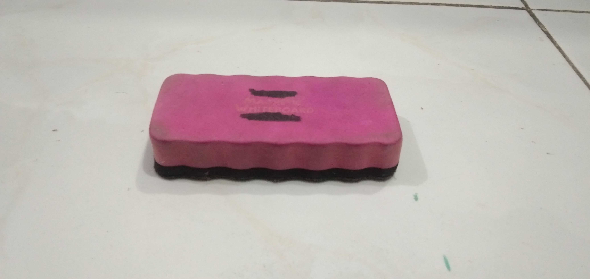
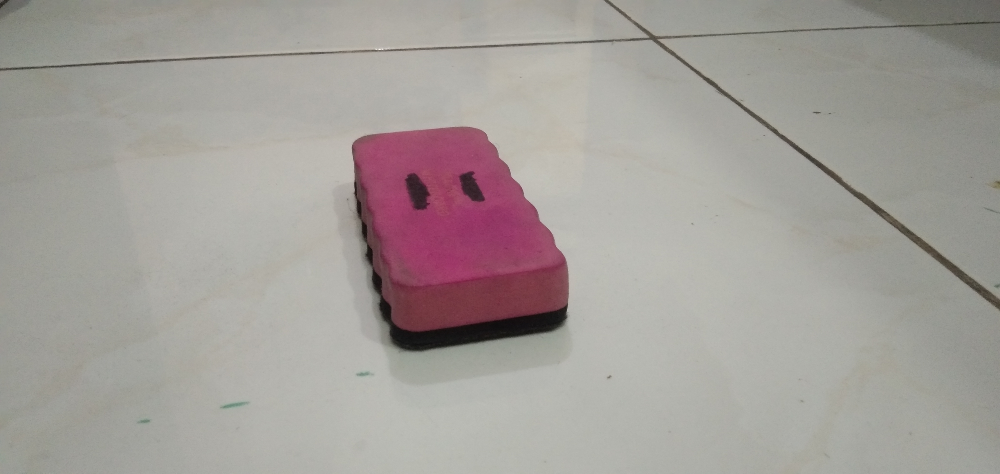
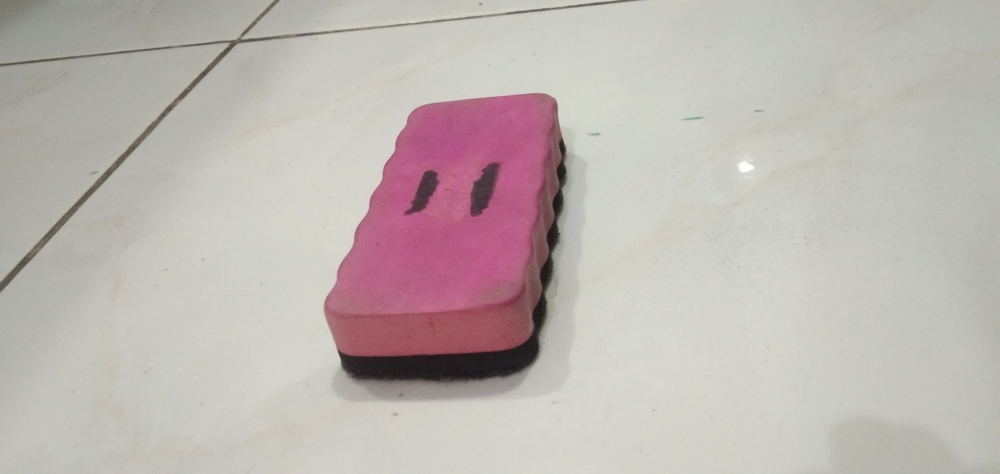
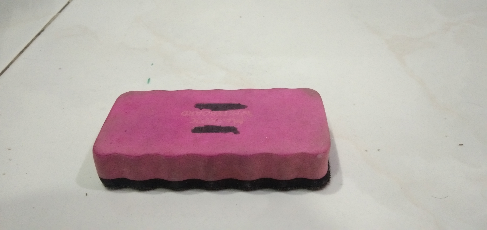

# Assigment 1 - E for Eraser of the Whiteboard

[](https://classroom.github.com/online_ide?assignment_repo_id=5667182&assignment_repo_type=AssignmentRepo)

## Description

```
Dear @here, please proceed the following instructions:
1. Find anything in your surrounding whose name starts with E, J, or O (in English).
2. Put the thing on a flat surface: table, floor, etc.
3. Take photos of the thing from four different perspectives: top right, top left, top rear, top front (you are free to specify the angle).
4. Click this assignment invitation URL: https://classroom.github.com/a/wxGcZEWk, to start initiating your assignment repository in GitHub.
5. Create a README.md file consisting of the thing's name and the four photos you have taken.
6. Do not forget to commit and push your changes.

Deadline: Wednesday, 2021/09/22, 07.00 AM
```

## Content - Eraser

### Front View



### Right View



### Left View



### Rear View



## Credits

```
Ahmad Syafiq Aqil Wafi
05111940000089
Computer Graphics E
```